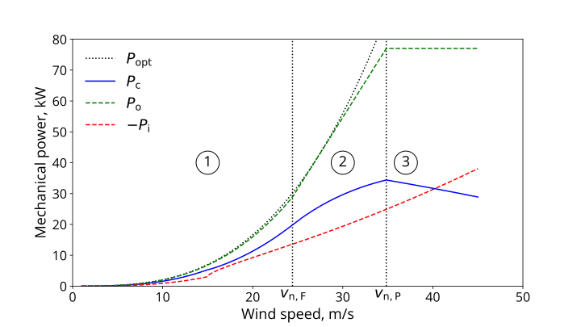
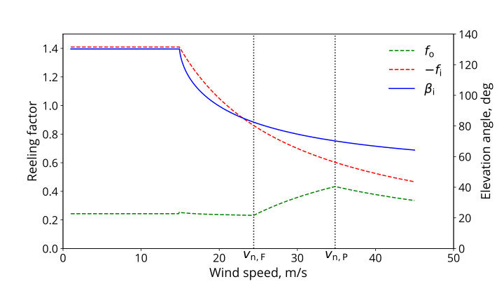

# Airborne wind energy on Mars

Data and code for investigating the feasibility of airborne wind energy on Mars in two contributed book chapters [[1,2]](#References).

## Scaling study [[1]](#References)

The two files are an Excel sheet `mcd_data.ods` with the tabulated data of the Mars Climate Database v6.1 for the Viking 1 and Arsia North sites and the file `scaling.py` to compute the scaling factors from the simplified relations given in the chapter.

## Performance analysis [[2]](#References)

The file `powercurve.py` generates a continuous power curve for a pumping airborne wind energy system in three wind speed regimes. The control strategy was first proposed in [[3]](#References) and was extended in the chapter to account for constant elevation angles during the reel-out and reel-in phases.

</img>
</img>

In contrast to [[3]](#References), the reel-in phase is modeled for constant lift-to-drag ratio of the kite, resulting in a reel-in elevation angle varying with the wind speed. This setup is more appropriate for soft-kite systems with slow actuation and a required safe distance from a negative angle of attack.

The file `powercurve_const_beta_in.py` contains the alternative implementation, outlined in parts already in [[3]](#References), with a constant reel-in elevation angle, resulting in a lift-to-drag ratio that varies with the wind speed. This implementation might prove helpful in fixed-wing kite systems with fast actuation that can fly at negative and positive angles of attack.

## Tools

The following external tools were used for the analysis

- Java Mission-planning and Analysis for Remote Sensing (JMARS). [https://jmars.mars.asu.edu](https://jmars.mars.asu.edu)
- Mars Climate Database (MCD). [https://www-mars.lmd.jussieu.fr](https://www-mars.lmd.jussieu.fr)

## References

[1] Gaunaa, M., Rodriguez, M., Ouroumova, L., Schmehl, R.: Scaling Airborne Wind Energy Systems for Deployment on Mars. In: Cervone, A., Bier, H., Makaya, A. (eds.) Adaptive Off-Earth Manufacturing. Springer Series in Adaptive Environments. Chapter 6. Springer Cham. 2023.

[2] Schmehl, R., Rodriguez, M., Ouroumova, L., Gaunaa, M.: Airborne Wind Energy for Martian Habitats. In: Cervone, A., Bier, H., Makaya, A. (eds.)  Adaptive Off-Earth Manufacturing. Springer Series in Adaptive Environments. Chapter 7. Springer Cham. 2023.

[3] Luchsinger, R.H.: Pumping Cycle Kite Power. In: Ahrens, U., Diehl, M., and Schmehl, R. (eds) Airborne Wind Energy. Green Energy and Technology. Springer, Berlin Heidelberg. Chap. 3, pp 47-64. doi:[10.1007/978-3-642-39965-7_3](https://doi.org/10.1007/978-3-642-39965-7_3).
